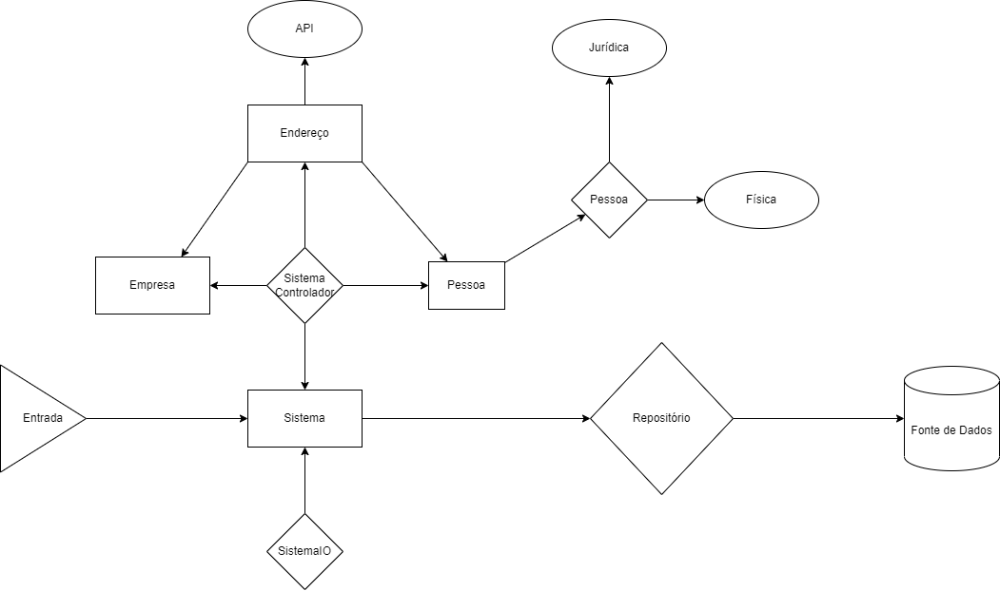

# Desafio Módulo Dart

Foi solicitado a criação de um *sistema* de **registros de empresas**.
Toda *empresa* nesse sistema deve ter um sócio associado a ela, que pode ser uma *Pessoa Física* ou uma *Pessoa Jurídica*.

## [ESTRUTURA DE DADOS]: Sobre as entidades

- [x] Uma **Empresa** no sistema tem os seguintes dados:
  - `Uuid` ID
  - `String` Razão Social
  - `String` Nome Fantasia
  - `String` CNPJ
  - `String` Telefone
  - `DateTime` Horário do Cadastro
  - `String` Sócio
  - *`Endereco` Endereço (Logradouro, Número, Complemento, Bairro,Estado e CEP).*

- [x] Uma **Pessoa Física** tem os seguintes dados:
  - `String` Nome
  - `String` CPF
  - *`Endereco` Endereço (Logradouro, Número, Complemento, Bairro,Estado e CEP).*

- [x] Uma **Pessoa Jurídica** tem os seguintes dados:
  - `String`Razão Social
  - `String` Nome Fantasia
  - `String` CNPJ
  - *`Endereco` Endereço (Logradouro, Número, Complemento, Bairro,Estado e CEP).*

O sistema ao ser executado deve oferecer as seguintes opções:

- [x] Cadastrar uma nova empresa;
- [x] Buscar Empresa cadastrada por CNPJ;
- [x] Buscar Empresa por CPF/CNPJ do Sócio;
- [x] Listar Empresas cadastradas em ordem alfabética (baseado na Razão Social);
- [x] Excluir uma empresa;
- [x] Sair.

## Requisitos

- [x] Toda pessoa seja física ou jurídica, devem saber validar seu
documento (CPF/CNPJ);
- [x] O programa deve ser criado considerando os recursos disponíveis da
Orientação à Objetos e boas práticas;
- [x] O programa deve ter no mínimo uma herança;
- [x] CPF e CNPJ são do tipo String, mas o input do usuário será apenas
números;
- [x] Telefone é do tipo String, mas o input do usuário será apenas
números, ex.: 11987654321;
- [x] CEP é do tipo String, mas o input do usuário será apenas números;
- [x] O ID deve ser único, para cada Empresa cadastrada;
- [x] O horário de cadastro deve ser obtido automaticamente pelo sistema;
- [x] A impressão do conteúdo de uma empresa deve atender no mínimo a
seguinte formatação:

### Solução

1. Abstração das Entidades
   1. Pessoa Física
   2. Pessoa Jurídica
   3. Endereço
   4. Empresa
2. Criação das camadas
   1. **Sistema**
      1. SistemaIO = resposável por se comunicar com usuário e validar os dados das entradas
      2. SistemaControladorEmpresa = responsável por instanciar um objeto da classe Empresa à partir da camada SistemIO
      3. SistemaControladorPessoa = responsável por instanciar um objto da classe Pessoa à partir da camada SistemIO
      4. SistemaControladorEndereco = responsável por instanciar um objeto da classe Endereço à partir das camadas SistemIO e externos ViaCepApi
   2. **Dominio**
      1. Entidades
         1. Empresa
            1. Pessoa
               1. Pessoa Física
                  1. Endereço
               2. Pessoa Jurídica
                  1. Endereço
            2. Endereço
   3. **Dados**
      1. Externos
         - [x] ViaCepApi = responsável por buscar dados de um endereço à partir de um CEP válido
      2. Fonte de Dados
         - [ ] Persistência local com Classe nativa ``File``
      3. Repositório
         - [x] Repositório padrão = implementação do contrato de repositório à partir de memória volátil
         - [ ] Repositório local = implementação do contrato de repositório à partir da Classe ``File``
3. Testes
   - [x] Testes Unitários das entidades

#### Referências

- Bibliotecas utilizadas
  - [pub.dev - Uuid](https://pub.dev/packages/uuid)
  - [pub.dev - File class](https://api.dart.dev/stable/2.18.0/dart-io/File-class.html)
  - [4devs](https://www.4devs.com.br/)
